### Codegraph cục bộ

- Nguồn: 5094 tệp mã; 3659 liên kết import cục bộ.
- Hiển thị: 20/3659 liên kết theo thứ tự ổn định.
- Phạm vi: chỉ import resolve được trong project; package ngoài không được đưa vào context.

```mermaid
graph TD
  n_6167656e742d72756e6e65722f736372697074732f616e7468726f7069632d72657472792d636865636b2e6d6a73["agent-runner/scripts/anthropic-retry-check.mjs"] --> n_6167656e742d72756e6e65722f7372632f70726f7669646572732f61646170746572732f616e7468726f7069632e7473["agent-runner/src/providers/adapters/anthropic.ts"]
  n_6167656e742d72756e6e65722f736372697074732f6d63702d636c69656e742d636865636b2e6d6a73["agent-runner/scripts/mcp-client-check.mjs"] --> n_6167656e742d72756e6e65722f7372632f6d63702d636c69656e742f696e6465782e7473["agent-runner/src/mcp-client/index.ts"]
  n_6167656e742d72756e6e65722f736372697074732f6f70656e61692d67656d696e692d72657472792d636865636b2e6d6a73["agent-runner/scripts/openai-gemini-retry-check.mjs"] --> n_6167656e742d72756e6e65722f7372632f70726f7669646572732f61646170746572732f67656d696e692e7473["agent-runner/src/providers/adapters/gemini.ts"]
  n_6167656e742d72756e6e65722f736372697074732f6f70656e61692d67656d696e692d72657472792d636865636b2e6d6a73["agent-runner/scripts/openai-gemini-retry-check.mjs"] --> n_6167656e742d72756e6e65722f7372632f70726f7669646572732f61646170746572732f6f70656e61692e7473["agent-runner/src/providers/adapters/openai.ts"]
  n_61692d726f757465722f636f72652f6f70656e2d7373652f636f6e6669672f617070436f6e7374616e74732e6a73["ai-router/core/open-sse/config/appConstants.js"] --> n_61692d726f757465722f636f72652f6f70656e2d7373652f636f6e6669672f70726f7669646572732e6a73["ai-router/core/open-sse/config/providers.js"]
  n_61692d726f757465722f636f72652f6f70656e2d7373652f636f6e6669672f617070436f6e7374616e74732e6a73["ai-router/core/open-sse/config/appConstants.js"] --> n_61692d726f757465722f636f72652f6f70656e2d7373652f70726f7669646572732f7368617265642e6a73["ai-router/core/open-sse/providers/shared.js"]
  n_61692d726f757465722f636f72652f6f70656e2d7373652f636f6e6669672f636f6e7374616e74732e6a73["ai-router/core/open-sse/config/constants.js"] --> n_61692d726f757465722f636f72652f6f70656e2d7373652f636f6e6669672f617070436f6e7374616e74732e6a73["ai-router/core/open-sse/config/appConstants.js"]
  n_61692d726f757465722f636f72652f6f70656e2d7373652f636f6e6669672f636f6e7374616e74732e6a73["ai-router/core/open-sse/config/constants.js"] --> n_61692d726f757465722f636f72652f6f70656e2d7373652f636f6e6669672f70726f7669646572732e6a73["ai-router/core/open-sse/config/providers.js"]
  n_61692d726f757465722f636f72652f6f70656e2d7373652f636f6e6669672f636f6e7374616e74732e6a73["ai-router/core/open-sse/config/constants.js"] --> n_61692d726f757465722f636f72652f6f70656e2d7373652f636f6e6669672f72756e74696d65436f6e6669672e6a73["ai-router/core/open-sse/config/runtimeConfig.js"]
  n_61692d726f757465722f636f72652f6f70656e2d7373652f636f6e6669672f6b69726f436f6e7374616e74732e6a73["ai-router/core/open-sse/config/kiroConstants.js"] --> n_61692d726f757465722f636f72652f6f70656e2d7373652f7472616e736c61746f722f636f6e6365726e732f7468696e6b696e672e6a73["ai-router/core/open-sse/translator/concerns/thinking.js"]
  n_61692d726f757465722f636f72652f6f70656e2d7373652f636f6e6669672f6b69726f436f6e7374616e74732e6a73["ai-router/core/open-sse/config/kiroConstants.js"] --> n_61692d726f757465722f636f72652f6f70656e2d7373652f7472616e736c61746f722f636f6e6365726e732f7468696e6b696e67556e69666965642e6a73["ai-router/core/open-sse/translator/concerns/thinkingUnified.js"]
  n_61692d726f757465722f636f72652f6f70656e2d7373652f636f6e6669672f70726f76696465724d6f64656c732e6a73["ai-router/core/open-sse/config/providerModels.js"] --> n_61692d726f757465722f636f72652f6f70656e2d7373652f636f6e6669672f70726f7669646572732e6a73["ai-router/core/open-sse/config/providers.js"]
  n_61692d726f757465722f636f72652f6f70656e2d7373652f636f6e6669672f70726f76696465724d6f64656c732e6a73["ai-router/core/open-sse/config/providerModels.js"] --> n_61692d726f757465722f636f72652f6f70656e2d7373652f70726f7669646572732f696e6465782e6a73["ai-router/core/open-sse/providers/index.js"]
  n_61692d726f757465722f636f72652f6f70656e2d7373652f636f6e6669672f70726f76696465724d6f64656c732e6a73["ai-router/core/open-sse/config/providerModels.js"] --> n_61692d726f757465722f636f72652f6f70656e2d7373652f70726f7669646572732f6d6f64656c732f68656c706572732e6a73["ai-router/core/open-sse/providers/models/helpers.js"]
  n_61692d726f757465722f636f72652f6f70656e2d7373652f636f6e6669672f70726f76696465724d6f64656c732e6a73["ai-router/core/open-sse/config/providerModels.js"] --> n_61692d726f757465722f636f72652f6f70656e2d7373652f70726f7669646572732f6d6f64656c732f736368656d612e6a73["ai-router/core/open-sse/providers/models/schema.js"]
  n_61692d726f757465722f636f72652f6f70656e2d7373652f636f6e6669672f70726f76696465724d6f64656c732e6a73["ai-router/core/open-sse/config/providerModels.js"] --> n_61692d726f757465722f636f72652f6f70656e2d7373652f70726f7669646572732f72656769737472792f696e6465782e6a73["ai-router/core/open-sse/providers/registry/index.js"]
  n_61692d726f757465722f636f72652f6f70656e2d7373652f636f6e6669672f70726f7669646572732e6a73["ai-router/core/open-sse/config/providers.js"] --> n_61692d726f757465722f636f72652f6f70656e2d7373652f70726f7669646572732f696e6465782e6a73["ai-router/core/open-sse/providers/index.js"]
  n_61692d726f757465722f636f72652f6f70656e2d7373652f636f6e6669672f72756e74696d65436f6e6669672e6a73["ai-router/core/open-sse/config/runtimeConfig.js"] --> n_61692d726f757465722f636f72652f6f70656e2d7373652f636f6e6669672f6572726f72436f6e6669672e6a73["ai-router/core/open-sse/config/errorConfig.js"]
  n_61692d726f757465722f636f72652f6f70656e2d7373652f636f6e6669672f7474734d6f64656c732e6a73["ai-router/core/open-sse/config/ttsModels.js"] --> n_61692d726f757465722f636f72652f6f70656e2d7373652f636f6e6669672f676f6f676c655474734c616e6775616765732e6a73["ai-router/core/open-sse/config/googleTtsLanguages.js"]
  n_61692d726f757465722f636f72652f6f70656e2d7373652f6578656375746f72732f616e7469677261766974792e6a73["ai-router/core/open-sse/executors/antigravity.js"] --> n_61692d726f757465722f636f72652f6f70656e2d7373652f636f6e6669672f617070436f6e7374616e74732e6a73["ai-router/core/open-sse/config/appConstants.js"]
  more["… 3639 liên kết đã lược bỏ"]
```

